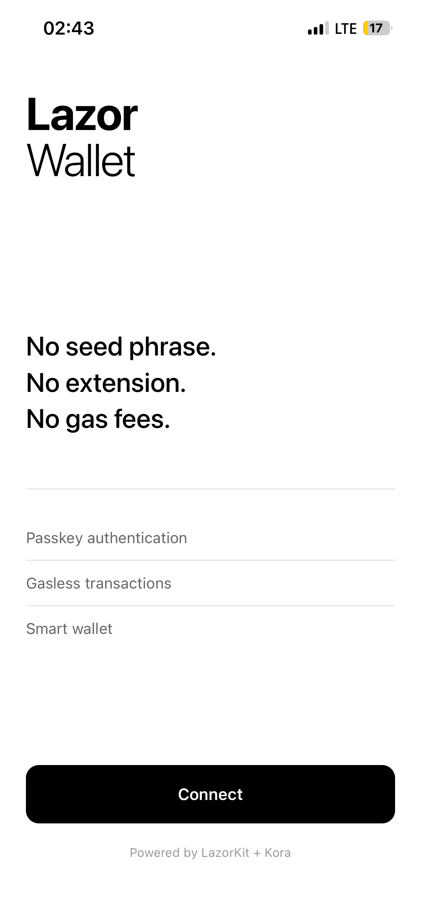
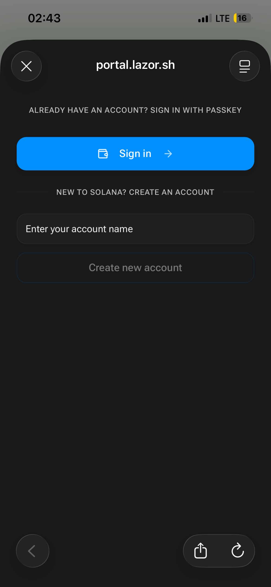
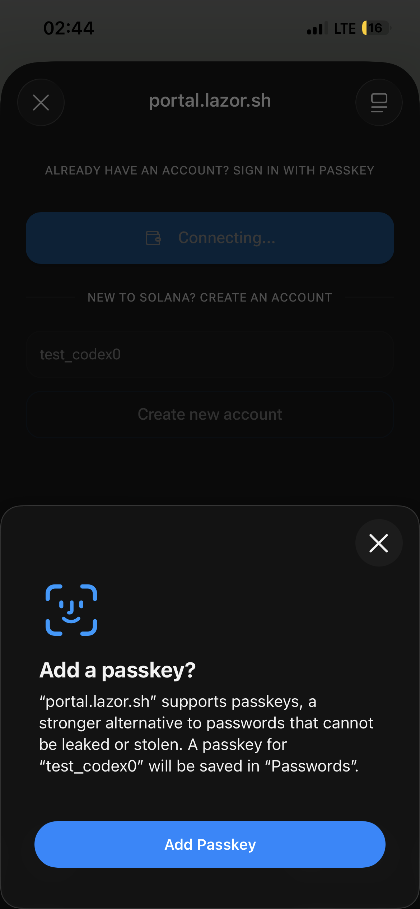
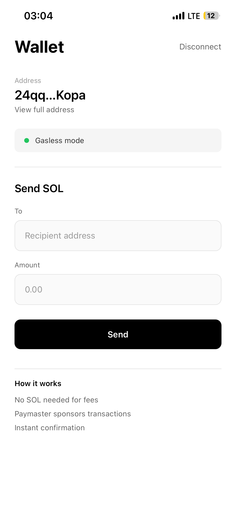

# Lazor Wallet Starter

A React Native (Expo) starter template demonstrating passkey-based wallet authentication and gasless transactions on Solana using LazorKit SDK.

## Demo

**[Download Android APK](https://expo.dev/accounts/solana-bridge/projects/seedless/builds/8c0916af-80c7-4f73-a57c-3a752da5917b)**

## Screenshots

<p align="center">
  
  
  
  
</p>

## Features

- **Passkey Authentication**: No seed phrases. Users authenticate with FaceID, TouchID, or fingerprint
- **Gasless Transactions**: Send SOL without holding any for fees. Kora paymaster sponsors transactions
- **Smart Wallet**: PDA-based wallet with recovery and programmable logic
- **Clean Architecture**: Minimal, well-documented code ready to extend

## Quick Start

### Prerequisites

- Node.js 20+
- Expo CLI (`npm install -g expo-cli`)
- iOS Simulator or Android Emulator

### Installation

```bash
# Clone the repo
git clone https://github.com/francis-codex/seedless.git
cd seedless

# Install dependencies
npm install

# Start the development server
npx expo start
```

### Running the App

```bash
# iOS Simulator
npx expo start --ios

# Android Emulator
npx expo start --android
```

**Note**: Passkeys require a native environment. They won't work in Expo Go web mode.

## Project Structure

```
lazor-wallet-starter/
├── App.tsx                 # Main app component
├── index.ts                # Entry point with polyfills
├── app.json                # Expo configuration
├── src/
│   ├── constants/          # Configuration constants
│   │   └── index.ts
│   ├── providers/          # React context providers
│   │   └── LazorProvider.tsx
│   └── screens/            # App screens
│       ├── HomeScreen.tsx  # Passkey connect screen
│       └── WalletScreen.tsx # Wallet and transfer screen
└── docs/
    ├── tutorial-1-passkey-wallet.md
    └── tutorial-2-gasless-transactions.md
```

## Configuration

Update `src/constants/index.ts` with your settings:

```typescript
// RPC endpoint
export const SOLANA_RPC_URL = 'https://api.devnet.solana.com';

// LazorKit configuration
export const PORTAL_URL = 'https://portal.lazor.sh';
export const PAYMASTER_URL = 'https://kora.devnet.lazorkit.com';
```

For production, use a private RPC endpoint (e.g., Helius, QuickNode) to avoid rate limits.

## How It Works

### Passkey Authentication

1. User taps "Connect"
2. App opens LazorKit portal in browser
3. User authenticates with device biometrics
4. Smart wallet PDA is created/retrieved
5. Session is established

### Gasless Transactions

1. App creates transaction instructions
2. LazorKit wraps transaction with paymaster
3. User signs with biometrics
4. Kora paymaster pays the fee
5. Transaction is broadcast and confirmed

## SDK Reference

### Provider

```tsx
import { LazorKitProvider } from '@lazorkit/wallet-mobile-adapter';

<LazorKitProvider
  rpcUrl="https://api.devnet.solana.com"
  portalUrl="https://portal.lazor.sh"
  configPaymaster={{ paymasterUrl: "https://kora.devnet.lazorkit.com" }}
>
  {children}
</LazorKitProvider>
```

### Hook

```tsx
import { useWallet } from '@lazorkit/wallet-mobile-adapter';

const {
  smartWalletPubkey,  // PublicKey | null
  isConnected,        // boolean
  isConnecting,       // boolean
  isSigning,          // boolean
  connect,            // (options) => Promise<WalletInfo>
  disconnect,         // () => Promise<void>
  signAndSendTransaction,  // (payload, options) => Promise<string>
} = useWallet();
```

### Connect

```tsx
import * as Linking from 'expo-linking';

await connect({
  redirectUrl: Linking.createURL('callback'),
  onSuccess: (wallet) => console.log('Connected:', wallet),
  onFail: (error) => console.error('Failed:', error),
});
```

### Send Transaction

```tsx
await signAndSendTransaction(
  {
    instructions: [transferInstruction],
    transactionOptions: {
      clusterSimulation: 'mainnet',
      // feeToken: USDC_MINT,  // Optional: pay fees in USDC
    },
  },
  {
    redirectUrl: Linking.createURL('sign-callback'),
    onSuccess: () => console.log('Sent'),
    onFail: (error) => console.error('Failed:', error),
  }
);
```

## Tutorials

- [Tutorial 1: Creating a Passkey Wallet](./docs/tutorial-1-passkey-wallet.md)
- [Tutorial 2: Gasless Transactions](./docs/tutorial-2-gasless-transactions.md)

## Resources

- [LazorKit Documentation](https://docs.lazorkit.com/)
- [LazorKit GitHub](https://github.com/lazor-kit/lazor-kit)
- [Kora Documentation](https://launch.solana.com/docs/kora)
- [Solana Passkeys Blog](https://www.helius.dev/blog/solana-passkeys)

## Tech Stack

- React Native (Expo SDK 54)
- TypeScript
- LazorKit SDK
- Kora Paymaster
- Solana Web3.js

## Deployment

### Expo Go (Development)

```bash
npx expo start
```

Scan QR code with Expo Go app.

### Development Build (Recommended for Passkeys)

```bash
npx expo prebuild
npx expo run:ios
# or
npx expo run:android
```

### Production Build

```bash
eas build --platform ios
eas build --platform android
```

## Troubleshooting

### Passkey not working

- Ensure you're running on a native device/simulator, not web
- Check that `scheme` is set in app.json
- Verify deep linking is configured correctly

### Transaction fails

- Check wallet has sufficient balance for transfer amount
- Verify recipient address is valid
- Check Kora paymaster status

### Polyfill errors

- Ensure polyfills are imported at the very top of index.ts
- Run `npx expo install expo-crypto` if crypto errors persist

## License

MIT
